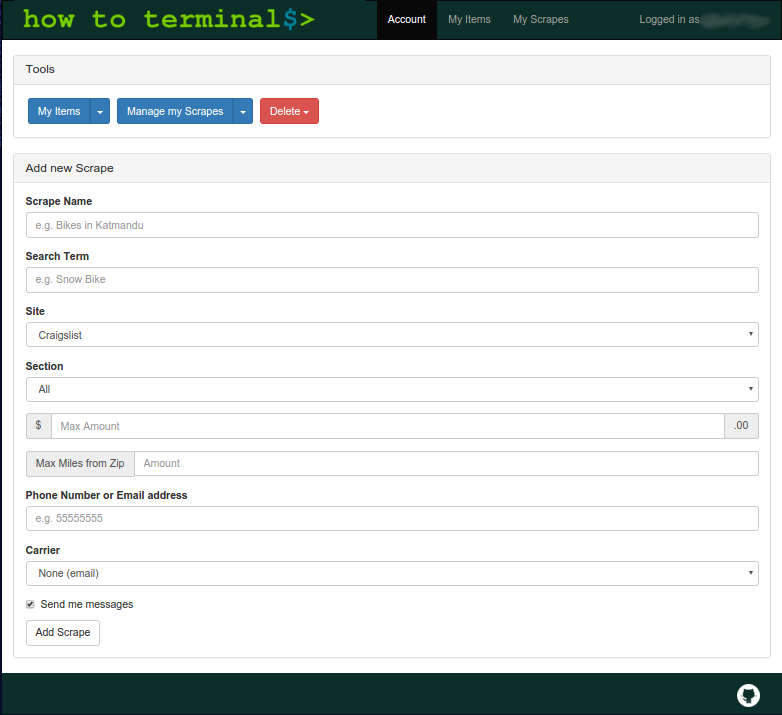

# bike-list
  

```sh
npm install
bower install
gulp
```  
### System Dependencies
`ssmtp`

## Env Setup
Must have a file in root named `.env`  
Required variables:  
```sh
EMAIL_FROM='soandso@whateva.com'
EMAIL_PASSWORD='password'
EMAIL_TO='Ady <555@text.republicwireless.com>, Jo <555@tmomail.net>'
MONGO_URI='mongodb://heroku_blablablablabla'
GOOGLE_CLIENT_ID='blablablabla'
GOOGLE_CLIENT_SECRET='whodei-wannaseeDisNow'
```  
`MONGO_URI` can be set up through [mLab](https://mlab.com/)  
Read into google authentication with passport [here](http://mherman.org/blog/2013/11/10/social-authentication-with-passport-dot-js/)  

Optional variables:  
```sh
POLLING=true
NO_SEND_MAIL=true
PORT=4000
ITEM_TYPE=Camera
NODE_ENV=dev
SUB_APP=true
OUTER_APP_DIR='../../howtoterminal-express'
BROWSER='firefox'
```  
